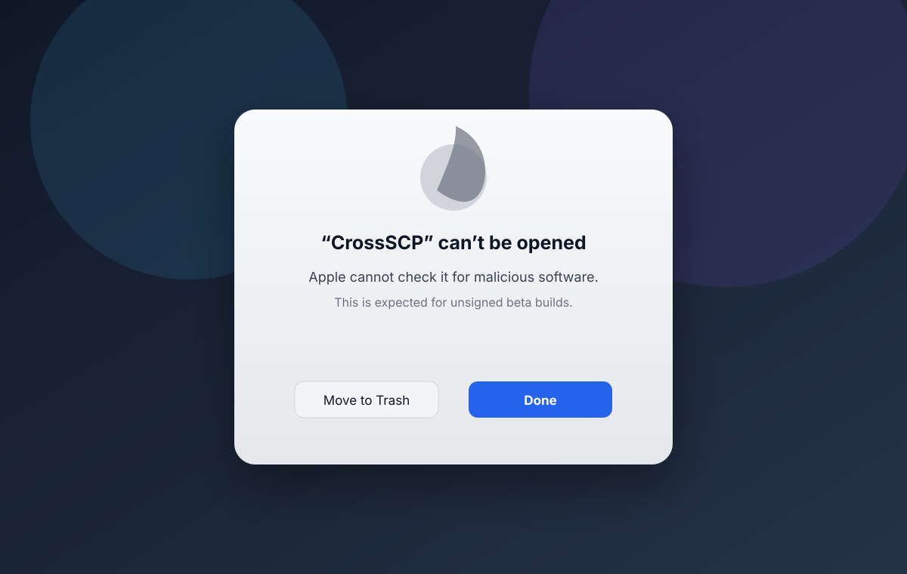
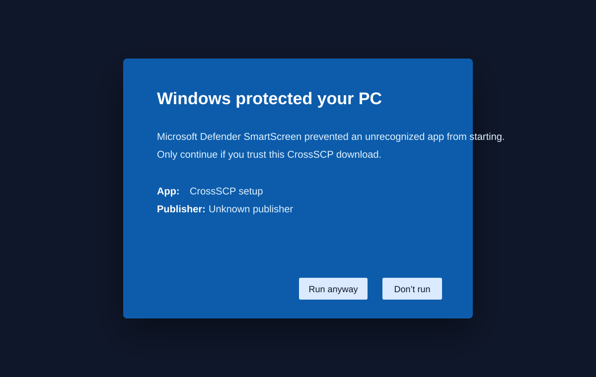
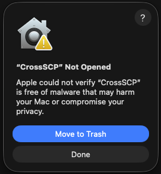
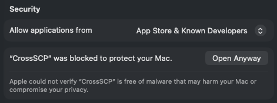
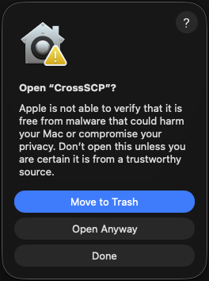

# CrossSCP Installation, Trust, and Uninstall Guide

CrossSCP is currently distributed as beta/test packages. The packages are useful
for testing, but they are not yet distributed through every platform's official
trust channel.

## Before installing: why warnings appear

CrossSCP is open source and the builds are produced by GitHub Actions, but some
operating systems still warn because the project does not yet use paid public
trust services.

### macOS Gatekeeper

Browser-downloaded macOS apps receive a quarantine flag. Without Apple Developer
ID signing and Apple notarization, macOS may block the app or show a strict
warning.

The free tester workaround is the terminal installer below. It downloads the DMG,
copies the app, and removes the quarantine flag from the installed copy.



### Windows SmartScreen / unverified publisher

Windows may show **Unknown Publisher**, **Unverified Publisher**, or SmartScreen
warnings for unsigned installers.

This does not mean the app is broken. It means the installer has not been signed
with a paid Authenticode code-signing certificate. To avoid this warning for
public users, CrossSCP will need an OV or EV Windows code-signing certificate.




### Linux package trust

Downloaded `.deb`, `.rpm`, and `.flatpak` files are beta artifacts. They can be
verified with checksums, but they are not the same as packages from APT, COPR,
or Flathub.

On Fedora, use either the RPM or Flatpak. Do not install the Ubuntu `.deb` on
Fedora.

## Verify downloads

Each package workflow emits `.sha256` checksums. Verify an artifact with:

```bash
shasum -a 256 -c CrossSCP-*.sha256
```

On Linux, use:

```bash
sha256sum -c CrossSCP-*.sha256
```

Linux artifacts may also include `.asc` detached signatures if GPG signing
secrets are configured.

## macOS quick install for testers

Recommended no-Apple-Developer-account tester install:

```bash
curl -fsSL https://raw.githubusercontent.com/pat229988/Cross-SCP/dev/scripts/install-macos.sh | bash
```

What this script does:

1. Finds the latest published CrossSCP macOS DMG release asset.
2. Downloads the DMG with `curl`.
3. Mounts it.
4. Copies `CrossSCP.app` to `/Applications`.
5. Removes the `com.apple.quarantine` attribute from the installed app.
6. Opens CrossSCP.

**Screenshot placeholder**: add `docs/assets/screenshots/macos-terminal-install.png`.

### macOS installer options

Install to another folder:

```bash
curl -fsSL https://raw.githubusercontent.com/pat229988/Cross-SCP/dev/scripts/install-macos.sh \
  | CROSSSCP_INSTALL_DIR="$HOME/Applications" bash
```

Install a specific tag:

```bash
curl -fsSL https://raw.githubusercontent.com/pat229988/Cross-SCP/dev/scripts/install-macos.sh \
  | CROSSSCP_VERSION="v0.1.0-beta.3" bash
```

Install from a direct DMG URL:

```bash
curl -fsSL https://raw.githubusercontent.com/pat229988/Cross-SCP/dev/scripts/install-macos.sh \
  | CROSSSCP_DMG_URL="https://example.com/CrossSCP.dmg" bash
```

If the release is still a GitHub draft/private release, set `GITHUB_TOKEN` or use
`CROSSSCP_DMG_URL` with an accessible URL.

### macOS manual install fallback

If you download the DMG through a browser and macOS blocks it:

1. Drag `CrossSCP.app` to `/Applications`.
2. First try the visual approval flow:
   - Click **Done** on the first warning.
   - Open **System Settings**.
   - Go to **Privacy & Security**.
   - Scroll to **Security**.
   - Click **Open Anyway** for CrossSCP.
   - In the final popup, click **Open Anyway**.
3. If needed, run:







```bash
sudo xattr -dr com.apple.quarantine /Applications/CrossSCP.app
open /Applications/CrossSCP.app
```

If you installed to `~/Applications` instead:

```bash
xattr -dr com.apple.quarantine "$HOME/Applications/CrossSCP.app"
open "$HOME/Applications/CrossSCP.app"
```

macOS packages include third-party notices inside
`CrossSCP.app/Contents/Resources/Legal/`. Qt is deployed as dynamically linked
frameworks under `CrossSCP.app/Contents/Frameworks/`, so users can replace
compatible Qt frameworks subject to normal macOS loader and signing
requirements. Do not publish a macOS GUI artifact if the legal notice directory
is missing.

### macOS uninstall

```bash
rm -rf /Applications/CrossSCP.app
rm -rf "$HOME/Applications/CrossSCP.app"
```

Optional user data cleanup:

```bash
rm -rf "$HOME/Library/Application Support/CrossSCP"
rm -rf "$HOME/Library/Preferences/org.crossscp.CrossSCP.plist"
rm -rf "$HOME/Library/Caches/CrossSCP"
```

## Windows install

Download one of the Windows artifacts from the GitHub Actions run or release:

- `CrossSCP-...-windows-x64-setup.exe` — NSIS installer
- `CrossSCP-...-windows-x64-portable.zip` — portable directory

If SmartScreen appears:

1. Click **More info**.
2. Confirm the app name is CrossSCP.
3. Click **Run anyway** only if you downloaded it from the official repository
   and verified the checksum.

The Windows installer and portable ZIP are built to include the required Qt DLLs
and Microsoft Visual C++ runtime DLLs, including:

- `Qt6Core.dll`
- `Qt6Gui.dll`
- `Qt6Qml.dll`
- `Qt6Quick.dll`
- `vcruntime140.dll`
- `msvcp140.dll`

If Windows reports one of these DLLs is missing, the package is incomplete and
should be rebuilt from the latest workflow artifacts.

Windows packages also include third-party notices in `Legal\`. Qt is deployed
as dynamically linked DLLs so users can replace compatible Qt DLLs subject to
normal Windows loader requirements. Do not publish a Windows GUI artifact if the
`Legal\THIRD_PARTY_NOTICES.md` and `Legal\LICENSES\QT-LGPL-COMPLIANCE.md`
files are missing.

### Windows uninstall

Use Windows Settings:

```text
Settings → Apps → Installed apps → CrossSCP → Uninstall
```

Or run the uninstaller from the Start Menu entry:

```text
CrossSCP → Uninstall CrossSCP
```

## Ubuntu / Debian install

The `.deb` package is for Debian/Ubuntu-based systems. It is not the right
package format for Fedora.

```bash
sudo apt install ./CrossSCP-*-ubuntu-amd64.deb
```

The `.deb` file is expected to be relatively small because it depends on system
Qt/QML packages instead of bundling the whole Qt runtime.
Third-party notices are installed under `/usr/share/doc/crossscp/`.

### Ubuntu / Debian uninstall

```bash
sudo apt remove crossscp
```

For a deeper cleanup:

```bash
bash scripts/uninstall-linux.sh --remove-config
```

## Fedora RPM install

Fedora uses RPM packages, not DEB packages. Download the Fedora RPM artifact:

```bash
sudo dnf install ./CrossSCP-*-fedora-x86_64.rpm
```

If DNF warns that the local RPM is unsigned, install only if you trust the
GitHub Actions artifact and checksum.

The `.rpm` file is expected to be relatively small because DNF installs the
required Qt/QML runtime packages from Fedora repositories.
Third-party notices are installed under `/usr/share/doc/crossscp/`.

### Fedora RPM uninstall

```bash
sudo dnf remove crossscp
```

If KDE still shows a stale CrossSCP launcher after uninstalling, use the deeper
cleanup script:

```bash
bash scripts/uninstall-linux.sh
```

To also remove CrossSCP user config/cache/data:

```bash
bash scripts/uninstall-linux.sh --remove-config
```

**Screenshot placeholder**: add `docs/assets/screenshots/fedora-kde-stale-launcher.png`.

## Flatpak install

Download the `.flatpak` artifact. On Fedora, first make sure Flathub is enabled
so Flatpak can fetch the KDE runtime referenced by the CrossSCP bundle:

```bash
sudo dnf install flatpak
flatpak remote-add --if-not-exists flathub https://flathub.org/repo/flathub.flatpakrepo
```

Then install and run CrossSCP:

```bash
flatpak install --user ./CrossSCP-*-linux-x86_64.flatpak
flatpak run org.crossscp.CrossSCP
```

The `.flatpak` file may still be only a few MB because it contains the CrossSCP
app layer, while the shared KDE runtime is downloaded separately from Flathub.

**Screenshot placeholders**:

- `docs/assets/screenshots/fedora-flatpak-install.png`
- `docs/assets/screenshots/fedora-kde-flatpak-launcher.png`

### Flatpak uninstall

User install:

```bash
flatpak uninstall --user org.crossscp.CrossSCP
```

System install:

```bash
sudo flatpak uninstall org.crossscp.CrossSCP
```

If you previously installed RPM/DEB builds too, use the cleanup script to remove
stale launchers:

```bash
bash scripts/uninstall-linux.sh
```

Then reinstall Flatpak:

```bash
flatpak install --user ./CrossSCP-*-linux-x86_64.flatpak
flatpak run org.crossscp.CrossSCP
```

## Linux post-install checks

Run from terminal first. This prints useful errors if a desktop launcher fails:

```bash
flatpak run org.crossscp.CrossSCP
```

For RPM/DEB installs:

```bash
/usr/bin/CrossSCP
```

Check for duplicate or stale launchers:

```bash
find ~/.local/share/applications /usr/share/applications \
  ~/.local/share/flatpak/exports/share/applications \
  /var/lib/flatpak/exports/share/applications \
  \( -iname '*crossscp*.desktop' -o -iname '*CrossSCP*.desktop' \) 2>/dev/null
```

On KDE, refresh the application menu cache:

```bash
kbuildsycoca6 --noincremental || kbuildsycoca5 --noincremental
```

If the old launcher still appears, log out and log back in.

## Linux complete cleanup script

The cleanup script removes:

- CrossSCP Flatpak user/system installs
- CrossSCP RPM installs
- CrossSCP DEB installs
- stale non-Flatpak desktop files from KDE/GNOME launchers
- optionally CrossSCP user config/cache/data

Preview what it would do:

```bash
bash scripts/uninstall-linux.sh --dry-run
```

Remove app packages and stale launchers:

```bash
bash scripts/uninstall-linux.sh
```

Remove app packages, stale launchers, and user config:

```bash
bash scripts/uninstall-linux.sh --remove-config
```

Non-interactive cleanup:

```bash
bash scripts/uninstall-linux.sh --yes --remove-config
```

## Troubleshooting quick commands

### Flatpak debug

```bash
flatpak list | grep -i crossscp
flatpak info org.crossscp.CrossSCP
flatpak run org.crossscp.CrossSCP
QT_DEBUG_PLUGINS=1 flatpak run org.crossscp.CrossSCP
```

### RPM/DEB debug

```bash
ldd /usr/bin/CrossSCP | grep -i 'not found' || true
ldd /usr/bin/crossscp-cli | grep -i 'not found' || true
/usr/bin/CrossSCP
```

### KDE launcher debug

```bash
grep -R "CrossSCP\|Exec=" ~/.local/share/applications /usr/share/applications \
  ~/.local/share/flatpak/exports/share/applications \
  /var/lib/flatpak/exports/share/applications 2>/dev/null
journalctl --user -n 100 --no-pager
```

## Adding screenshots to this guide

Place screenshots in:

```text
docs/assets/screenshots/
```

Then replace screenshot placeholders with Markdown image links, for example:

```markdown

```
