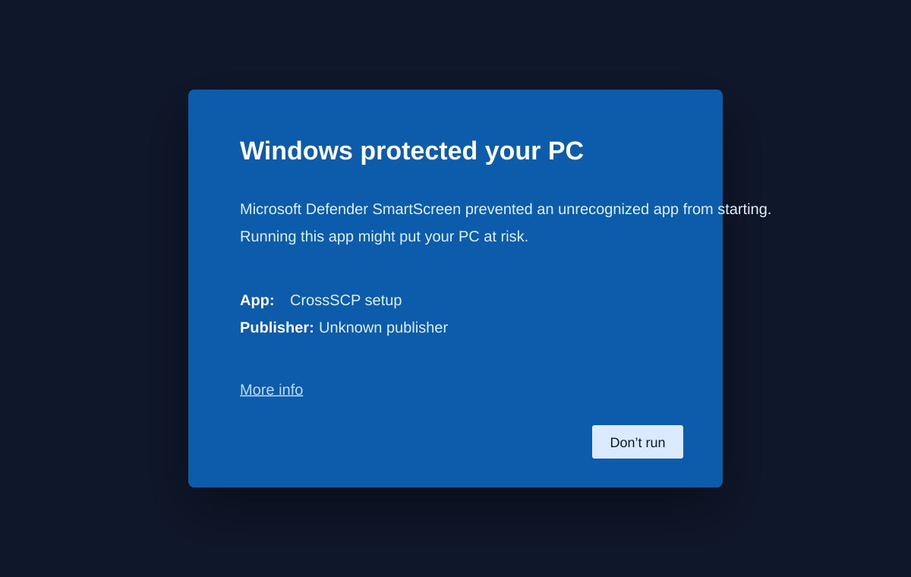

# Local Documentation Preview and Checks

Use these commands before publishing the repository or updating the download
page.

## Check Markdown links and anchors manually

From the repository root:

```bash
ls docs README.md packaging/SIGNING.md
python3 -m http.server 8080 --directory docs
```

Open:

```text
http://localhost:8080/
```

Rendered install guide:

```text
http://localhost:8080/install.html
```

Download page:

```text
http://localhost:8080/download.html
```

Review:

- Home/landing page layout
- Download links
- Installation guide link targets
- Screenshot placeholders

Stop the server with `Ctrl+C`.

## Preview Markdown locally

If VS Code is installed:

```bash
code docs/INSTALLATION.md
```

Then use **Open Preview**.

If Python Markdown is available:

```bash
python3 -m pip install --user markdown
python3 -m markdown docs/INSTALLATION.md > /tmp/crossscp-installation.html
open /tmp/crossscp-installation.html 2>/dev/null || xdg-open /tmp/crossscp-installation.html
```

## Validate helper scripts

```bash
bash -n scripts/install-macos.sh
bash -n scripts/uninstall-linux.sh
bash scripts/uninstall-linux.sh --dry-run
```

## Validate GitHub workflow YAML

```bash
ruby -e 'require "yaml"; ARGV.each { |f| YAML.load_file(f); puts "YAML ok: #{f}" }' .github/workflows/*.yml
```

## Screenshot workflow

Place screenshots under:

```text
docs/assets/screenshots/
```

Recommended names:

```text
macos-install.png
windows-install.png
linux-install.png
macos-gatekeeper-warning.svg
macos-terminal-install.png
windows-smartscreen-more-info.svg
windows-smartscreen-run-anyway.svg
fedora-flatpak-install.png
fedora-kde-stale-launcher.png
fedora-kde-flatpak-launcher.png
```

After adding screenshots, replace the placeholders in `docs/INSTALLATION.md`
with Markdown image links, for example:

```markdown

```
